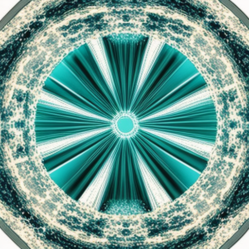

# Отчёт по лабораторной работе №1

## Запуск открытой модели text-to-image и фиксация воспроизводимого результата

| | |
| --- | --- |
| **Дисциплина** | Искусственный интеллект в креативных технологиях |
| **Лабораторная работа** | №1. Запуск открытой модели text-to-image |
| **Вариант** | **11** — иллюстрация для материала о кибербезопасности |
| **Изменяемый фактор** | метафора защиты без интерфейсных клише |
| **Автор** | ykvnkm |
| **Дата выполнения** | 17–18.09.2026 |
| **Репозиторий** | https://github.com/ykvnkm/ai-in-creative-industries |
| **Каталог работы** | [`LR01/`](.) |

---

## 1. Цель, постановка задачи и критерии успешности

### 1.1. Цель

Получить один воспроизводимый результат text-to-image по индивидуальному варианту
и доказать происхождение каждого артефакта: модель, ревизию, параметры генерации,
среду исполнения и целостность файлов.

Цель работы **не** состоит в получении эстетически удачного изображения. Успех
определяется тем, может ли посторонний человек по сохранённым материалам
восстановить запуск и объяснить границы совпадения результатов.

### 1.2. Постановка задачи по варианту 11

| Поле варианта | Содержание |
| --- | --- |
| Контекст | Иллюстрация для материала о кибербезопасности |
| Изменяемый фактор или решение | Метафора защиты без интерфейсных клише |
| Обязательная проверка | Запустить и провалидировать артефакты |
| Артефакт | Иллюстрация и JSON |
| Критерий результата | Метафора объяснена в отчёте |
| Ограничение или риск | Не показывать реальные секреты и ключи |

Задача: сформулировать безопасный авторский prompt, содержащий объект, среду,
палитру и композицию; выполнить запуск закреплённой ревизии открытой модели;
повторить запуск без изменения условий; провалидировать артефакты формально;
воспроизвести намеренную типовую ошибку и объяснить её; зафиксировать границы
полученного вывода.

### 1.3. Критерии успешности (формулируются до запуска)

| № | Критерий | Способ проверки |
| --- | --- | --- |
| К1 | Программа завершается без исключения и создаёт PNG и JSON одним запуском | код возврата `0`, наличие файлов |
| К2 | Изображение имеет размер 512 × 512 | `PIL.Image.open(...).size` |
| К3 | `manifest.json` — валидный JSON и содержит все поля фиксации | `json.tool`, `src/validate_artifacts.py` |
| К4 | SHA-256 состоит из 64 шестнадцатеричных символов и совпадает с файлом | пересчёт хеша файла |
| К5 | Повторный запуск в той же среде даёт тот же SHA-256 | `reports/sha256_comparison.json` |
| К6 | Намеренная ошибка воспроизведена, симптом и исправление описаны | `reports/error_demo.log` |
| К7 | Метафора защиты объяснена, интерфейсные клише отсутствуют | визуальный разбор в разделе 5.4 |

Критерии К1–К6 проверяются автоматически. Критерий К7 — содержательный, он
проверяется разбором полученного изображения, а не задаётся заранее.

---

## 2. Происхождение prompt, ограничения данных и лицензии

### 2.1. Происхождение входных данных

Единственные входные данные работы — авторский текстовый prompt. Он составлен
автором работы специально для варианта 11. Полный разбор с обоснованием каждого
элемента вынесен в [`data/prompt.md`](data/prompt.md).

```
abstract editorial illustration of layered protection, a smooth matte stone core
enclosed by several concentric translucent glass shells, neutral seamless studio
backdrop, deep teal and pale sand palette, centered symmetrical composition with
wide empty margins, soft diffused light, no text, no logo, no people, no padlock,
no shield emblem, no binary code, no user interface
```

### 2.2. Четыре обязательных элемента prompt

| Элемент | Формулировка | Назначение |
| --- | --- | --- |
| Объект | `a smooth matte stone core enclosed by several concentric translucent glass shells` | носитель метафоры: ядро и последовательность проницаемых оболочек |
| Среда | `neutral seamless studio backdrop`, `soft diffused light` | снимает повествовательный контекст, оставляет объект единственным носителем смысла |
| Палитра | `deep teal and pale sand palette` | холодный технологический тон против тёплого нейтрального; без красного и зелёного, чтобы изображение не считывалось как индикатор статуса |
| Композиция | `centered symmetrical composition with wide empty margins` | симметрия поддерживает идею равномерной защиты; поля оставляют место под редакционную вёрстку |

### 2.3. Ограничения по данным (риск варианта 11)

Ограничение варианта — «не показывать реальные секреты и ключи». Оно выполнено
на уровне входных данных, а не постобработки:

- [x] не использованы персональные данные;
- [x] не использованы реальные ключи, пароли, токены, фрагменты конфигураций или логов;
- [x] не использованы закрытые брифы и клиентские материалы;
- [x] не использованы товарные знаки и логотипы;
- [x] не использованы изображения реальных людей;
- [x] prompt не описывает конкретную существующую систему защиты.

Подчеркну отдельно: prompt по построению **не может** породить читаемый секрет,
поскольку не содержит никаких символьных данных, а ограничение `no text` дополнительно
подавляет генерацию знаковых форм.

### 2.4. Лицензия и допустимость использования модели

Модель `stabilityai/sd-turbo` распространяется на условиях **Stability AI
Non-Commercial Research Community License**. Карточка модели описывает её как
исследовательский артефакт и отдельно отсылает к Acceptable Use Policy Stability AI.

Практические следствия для данной работы:

1. Использование учебное и некоммерческое — это соответствует условиям лицензии.
2. Коммерческое применение результата потребует отдельной проверки условий и,
   вероятно, отдельного соглашения со Stability AI.
3. Термин «открытая модель» здесь означает доступность весов и документации для
   локального исследования. Он **не** означает соответствие лицензии критериям OSI
   и не отменяет ограничений.
4. Загруженная конфигурация pipeline **не содержит safety checker**. Для
   контролируемого учебного эксперимента с нейтральным prompt это допустимо; для
   открытого сервиса потребовались бы отдельный фильтр и политика модерации.

Источник: https://huggingface.co/stabilityai/sd-turbo (проверено 17.09.2026).

### 2.5. Статус результата

Полученное изображение является **учебным концептом**. Оно не документирует
реальную систему информационной безопасности, не является схемой устройства
и не может использоваться как иллюстрация фактических данных.

---

## 3. Среда, версии, модель, ревизия, устройство и параметры

### 3.1. Площадка выполнения

Работа выполнена **локально**, на собственной машине автора, без обращения к
внешним генеративным сервисам. Курс допускает engee.com, Hugging Face, Ollama и
OpenCLAW; здесь использован локальный инференс через библиотеку Hugging Face
Diffusers, поскольку методические указания требуют запуска модели с открыто
доступными весами и фиксации среды исполнения — удалённый сервис такой фиксации
не даёт.

### 3.2. Аппаратная и программная среда

| Параметр | Значение |
| --- | --- |
| Машина | Apple M4, arm64 |
| ОС | macOS 26.6.2 (build 25G83) |
| Python | 3.12.8 |
| Устройство инференса | `cpu` |
| Тип данных | `torch.float32` |
| `torch.cuda.is_available()` | `False` |
| `torch.backends.mps.is_available()` | `True` (сознательно не используется, см. 3.4) |
| Число потоков PyTorch | `1` (зафиксировано явно) |
| Детерминированные алгоритмы | `torch.use_deterministic_algorithms(True)` |

### 3.3. Версии библиотек

| Пакет | Версия |
| --- | --- |
| torch | 2.14.0 |
| torchvision | 0.29.0 |
| diffusers | 0.40.0 |
| transformers | 5.17.0 |
| accelerate | 1.15.0 |
| safetensors | 0.8.0 |
| huggingface-hub | 1.32.0 |
| Pillow | 12.3.0 |

Полный слепок окружения: [`reports/environment.txt`](reports/environment.txt),
создан после установки зависимостей и до запуска модели.
Проверка среды до загрузки весов: [`reports/env_check.log`](reports/env_check.log).

### 3.4. Обоснование выбора CPU при доступном ускорителе

На Apple M4 доступен backend MPS, и он быстрее CPU. Он сознательно не использован.

Причина: предмет проверки в этой работе — **побитовая воспроизводимость**, а не
скорость. Связка CPU + `float32` + фиксированное число потоков + запрет
недетерминированных ядер даёт контролируемый порядок редукций и, как следствие,
ожидание одинаковых байтов между запусками. Путь MPS + `float16` даёт выигрыш по
времени, но добавляет источники расхождения (другие ядра, другая точность,
другой порядок операций), и тогда основной измеряемый критерий работы пришлось
бы объяснять, а не демонстрировать.

Это явное проектное решение: время запуска принесено в жертву проверяемости.

### 3.5. Модель и ревизия

| Параметр | Значение |
| --- | --- |
| `model_id` | `stabilityai/sd-turbo` |
| `revision` | `b261bac6fd2cf515557d5d0707481eafa0485ec2` |
| Формат весов | `safetensors`, `use_safetensors=True` |
| Источник | https://huggingface.co/stabilityai/sd-turbo |

Ревизия закреплена полным хешом коммита, а не тегом и не именем ветки. Обращение
по одному лишь `model_id` указывает на подвижный снимок репозитория: владелец
модели может обновить веса или конфигурацию, и тот же код начнёт давать другой
результат без единого изменения в коде.

### 3.6. Параметры генерации

| Параметр | Значение | Обоснование |
| --- | --- | --- |
| `prompt` | см. раздел 2.1 | авторский текст варианта 11 |
| `seed` | `20260911` | год `2026`, месяц `09`, номер варианта `11`; отличается от seed демонстрационного примера методички, чтобы результаты не смешивались |
| `num_inference_steps` | `4` | разработчик SD Turbo рекомендует 1–4 шага; выбран верх диапазона ради читаемости формы оболочек, что существенно для критерия варианта |
| `guidance_scale` | `0.0` | для SD Turbo обычный classifier-free guidance не применяется |
| `height` × `width` | 512 × 512 | рекомендованный для модели размер; квадрат соответствует формату редакционной иллюстрации |
| `generator` | `torch.Generator(device="cpu")` | CPU-генератор сопоставим между устройствами, см. документацию Diffusers |

Все параметры хранятся в одном файле [`configs/run_config.json`](configs/run_config.json)
и не продублированы в коде. Манифест каждого запуска повторяет эти поля, а
`src/validate_artifacts.py` проверяет их совпадение с конфигом.

---

## 4. Ход работы, команды запуска и существенный код

### 4.1. Последовательность шагов

| Шаг | Действие | Результат / артефакт |
| --- | --- | --- |
| 1 | Создание структуры проекта `data / src / configs / artifacts / reports` | каталоги работы |
| 2 | Создание виртуального окружения, установка зависимостей | `.venv` (не коммитится) |
| 3 | Попытка установки по спецификации методических указаний | `reports/dependency_conflict.log` — **отказ**, разбор в 6.1 |
| 4 | Установка совместимой комбинации зависимостей | `reports/environment.txt` |
| 5 | Проверка среды до загрузки весов | `reports/env_check.log` |
| 6 | Формулирование prompt варианта 11 | `data/prompt.md`, `configs/run_config.json` |
| 7 | Запуск 1 (включает разовую загрузку весов) | `artifacts/run_001/`, `reports/run_001.log` |
| 8 | Запуск 2 без изменения условий, отдельным процессом | `artifacts/run_002/`, `reports/run_002.log` |
| 9 | Сравнение контрольных сумм | `reports/sha256_comparison.json` |
| 10 | Формальная валидация артефактов | `reports/validation.log` |
| 11 | Воспроизведение намеренной ошибки | `reports/error_demo.log` |
| 12 | Сборка контрольных сумм сдаваемых файлов | `MANIFEST.sha256` |

### 4.2. Команды запуска

Подготовка среды:

```bash
python3.12 -m venv .venv
.venv/bin/python -m pip install --upgrade pip
.venv/bin/python -m pip install torch torchvision
.venv/bin/python -m pip install "diffusers==0.40.0" "transformers>=5,<6" \
    "accelerate>=1.2,<2" "safetensors>=0.5,<1" "Pillow>=11,<13"
.venv/bin/python -m pip freeze > reports/environment.txt
```

Проверка среды до загрузки весов:

```bash
.venv/bin/python -c "import torch, diffusers; print(torch.__version__); print(diffusers.__version__); print(torch.cuda.is_available())"
```

Основной запуск, повтор и сравнение:

```bash
export HF_HOME="$PWD/cache/huggingface"
.venv/bin/python src/run_reproducibility.py
```

Валидация артефактов и воспроизведение ошибки:

```bash
.venv/bin/python src/validate_artifacts.py 2>&1 | tee reports/validation.log
.venv/bin/python src/error_demo_cuda_generator.py 2>&1 | tee reports/error_demo.log
```

Контроль целостности сдаваемых файлов:

```bash
.venv/bin/python src/make_manifest.py
shasum -a 256 -c MANIFEST.sha256
```

Переменная `HF_HOME` задана внутри каталога работы намеренно: кэш весов остаётся
локальным, воспроизводимо расположенным и целиком исключён из репозитория через
`.gitignore`.

### 4.3. Существенный код

Полностью: [`src/generate_once.py`](src/generate_once.py). Ключевая часть — выбор
устройства, фиксация детерминизма и создание генератора:

```python
# Детерминизм фиксируется явно: число потоков и запрет недетерминированных ядер.
torch.set_num_threads(int(config["torch_num_threads"]))
torch.use_deterministic_algorithms(bool(config["deterministic_algorithms"]))

# Устройство выбирается только после проверки доступности.
device = "cuda" if torch.cuda.is_available() else "cpu"
dtype = torch.float16 if device == "cuda" else torch.float32

pipe = AutoPipelineForText2Image.from_pretrained(
    config["model_id"],
    revision=config["revision"],      # ревизия закреплена
    use_safetensors=True,
    torch_dtype=dtype,
).to(device)

# CPU Generator сопоставим между устройствами, см. документацию Diffusers.
generator = torch.Generator(device="cpu").manual_seed(int(config["seed"]))

image = pipe(
    prompt=config["prompt"],
    num_inference_steps=int(config["num_inference_steps"]),
    guidance_scale=float(config["guidance_scale"]),
    height=int(config["height"]),
    width=int(config["width"]),
    generator=generator,
).images[0]
```

Манифест собирается из фактически наблюдённых значений, а не из ожидаемых:
размер и цветовой режим читаются из **сохранённого** файла, SHA-256 считается по
байтам записанного PNG, время измеряется `time.perf_counter()`.

```python
with Image.open(image_path) as saved:
    image_size_observed = list(saved.size)
    image_mode_observed = saved.mode
...
"sha256": sha256_of(image_path),
```

### 4.4. Отличие схемы повтора от примера методических указаний

В демонстрационном примере повтор выполняется тем же скриптом. В данной работе
`src/run_reproducibility.py` запускает `src/generate_once.py` **отдельным
процессом** для каждого запуска:

```python
completed = subprocess.run(
    [sys.executable, str(ROOT / "src" / "generate_once.py"), run_name],
    capture_output=True, text=True, cwd=ROOT,
)
```

Это усиливает проверку: сравниваются два полных цикла «загрузка pipeline →
генерация → сохранение», а не два вызова уже прогретого объекта в одном процессе.
Второй вариант не заметил бы расхождений, связанных с инициализацией модели,
порядком загрузки весов или состоянием процесса.

---

## 5. Результаты и их проверка

### 5.1. Полученные артефакты

| Запуск | Артефакт | Манифест | Журнал |
| --- | --- | --- | --- |
| Запуск 1 | [`artifacts/run_001/result.png`](artifacts/run_001/result.png) | [`manifest.json`](artifacts/run_001/manifest.json) | [`reports/run_001.log`](reports/run_001.log) |
| Запуск 2 | [`artifacts/run_002/result.png`](artifacts/run_002/result.png) | [`manifest.json`](artifacts/run_002/manifest.json) | [`reports/run_002.log`](reports/run_002.log) |



*Рисунок 1. `artifacts/run_001/result.png`. Учебный концепт редакционной
иллюстрации к материалу о кибербезопасности. Не является документальным
изображением и не описывает реальную систему защиты.*

### 5.2. Сравнение двух запусков

| Проверка | Запуск 1 | Запуск 2 |
| --- | ---: | ---: |
| Время загрузки pipeline, с | 0.366 | 0.328 |
| Время генерации, с | 20.188 | 15.834 |
| Размер файла, байт | 574124 | 574124 |
| Размер изображения | 512 × 512 | 512 × 512 |
| Цветовой режим | RGB | RGB |
| Устройство / dtype | cpu / `torch.float32` | cpu / `torch.float32` |

SHA-256:

```
запуск 1: 1f14ca3a96390159968da9c05e7409b5f3a8d9c429715febaf0904eadf02bef6
запуск 2: 1f14ca3a96390159968da9c05e7409b5f3a8d9c429715febaf0904eadf02bef6
```

**Побитовое сравнение: PASS.**
Машиночитаемый результат: [`reports/sha256_comparison.json`](reports/sha256_comparison.json),
поле `"exact_sha256_match": true`.

Два PNG побайтово идентичны. Критерий К5 выполнен: повторный запуск в той же зафиксированной среде, выполненный отдельным процессом с повторной загрузкой весов, дал тот же файл.

Время загрузки pipeline (0,37 с и 0,33 с) относится к чтению весов из
локального кэша с отображением файла в память. Разовая загрузка весов с Hugging
Face Hub в это время не входит: она выполнялась один раз, до запусков, и заняла
существенно больше — около 5 ГБ по каналу порядка 1,5 МБ/с. Для оценки стоимости
повторного запуска значима именно измеренная величина, для оценки стоимости
развёртывания с нуля — время первичной загрузки.

Измеренное время генерации у запусков различается
(20.2 с против 15.8 с) — это
наблюдаемое свидетельство того, что вычисление действительно выполнялось дважды,
а совпадение хешей не является следствием переиспользования файла.

### 5.3. Формальная валидация артефактов

Обязательная проверка варианта 11 — «запустить и провалидировать артефакты».
Выполнена скриптом [`src/validate_artifacts.py`](src/validate_artifacts.py),
журнал: [`reports/validation.log`](reports/validation.log).

Проверок пройдено: **36**, провалено: **0**. Итог: **PASS**.

| Критерий | Способ | Результат |
| --- | --- | --- |
| К1. Запуск без исключения, созданы PNG и JSON | код возврата, наличие файлов | PASS |
| К2. Размер 512 × 512 | `PIL.Image.open(...).size` | 512 × 512 |
| К3. `manifest.json` — валидный JSON со всеми полями | разбор + проверка полей | PASS |
| К4. SHA-256 — 64 hex-символа, совпадает с файлом | независимый пересчёт хеша | PASS |
| К5. Повтор даёт тот же SHA-256 | `sha256_comparison.json` | PASS |

Важно, что валидатор пересчитывает хеш **сам**, по байтам сохранённого файла, и
сверяет поля манифеста с конфигом. Он не доверяет выводу генерирующего скрипта.

Цветовой режим зафиксирован как наблюдаемый: `RGB`. Это
фактическое значение из сохранённого файла, а не ожидаемое заранее.

### 5.4. Разбор результата: считывается ли метафора

Критерий варианта 11 — «метафора объяснена в отчёте». Чтобы разбор не сводился к
впечатлению, свойства изображения измерены скриптом
[`src/analyze_image.py`](src/analyze_image.py); результат:
[`reports/image_analysis_run_001.json`](reports/image_analysis_run_001.json).

**Палитра (доминирующие цвета, медианное сечение на 6 кластеров):**

| № | Цвет | RGB | Доля кадра |
| --- | --- | --- | ---: |
| 1 | `#3b847d` | 59, 132, 125 | 24.0 % |
| 2 | `#124645` | 18, 70, 69 | 23.4 % |
| 3 | `#a6bfb1` | 166, 191, 177 | 16.1 % |
| 4 | `#f0f2e4` | 240, 242, 228 | 14.3 % |
| 5 | `#d6d8c5` | 214, 216, 197 | 11.3 % |
| 6 | `#55b3ab` | 85, 179, 171 | 10.8 % |

**Тон и контраст:**

| Метрика | Значение |
| --- | ---: |
| Средняя яркость | 0.5663 |
| Разброс яркости (СКО) | 0.2577 |
| 1-й процентиль яркости | 0.0818 |
| 99-й процентиль яркости | 0.9823 |
| Контраст по Майкельсону | 0.8462 |

**Композиция:**

| Метрика | Значение |
| --- | ---: |
| Плотность деталей в центре кадра | 0.10352 |
| Плотность деталей на полях | 0.12461 |
| Отношение «центр / поля» | 0.831 |
| Ошибка зеркальной симметрии по вертикальной оси | 0.12608 |

**Что изображение показывает фактически.** В кадре — радиально-симметричная
структура: яркое кольцо в геометрическом центре, от него расходятся клиновидные
сегменты, вокруг — несколько концентрических текстурных поясов. Слои различимы и
последовательны, ядро отделено от окружения.

**Метафора считывается, но не в той форме, которая закладывалась.** Замысел —
предметная сцена: матовое каменное ядро внутри стеклянных оболочек на нейтральном
фоне. Модель выдала графический орнамент: те же концентрические слои, но как
плоский узор, без объёма, фона и светотени. Идея эшелонированной защиты —
ценность в центре, вокруг неё последовательность проницаемых слоёв — передана;
предметная сцена, названная в prompt, — нет.

**Палитра: соответствует брифу.** Три бирюзовых кластера занимают 58,2 % кадра,
два светлых песочных — 25,6 %. Заданная пара «deep teal + pale sand» получена,
причём без сигнальных красного и зелёного, которые превратили бы изображение в
индикатор статуса.

**Композиция: требование не выполнено, и это измеримо.** В prompt заявлены
`wide empty margins`. Отношение плотности деталей «центр / поля» равно **0,831**,
то есть поля кадра насыщеннее центра, а не пустее: узор идёт до самого края.
Для сравнения, у изображения демонстрационного примера (Приложение А) то же
отношение равно 1,0. Пригодного под редакционную вёрстку свободного поля в кадре
нет — для реальной публикации потребовалось бы кадрирование или повторная
генерация.

**Симметрия: заявлять её по этой метрике нельзя.** Ошибка зеркального отражения
по вертикальной оси — 0,126 против 0,137 у контрольного изображения с совершенно
другим prompt. Разница слишком мала, чтобы служить доказательством: метрика
сравнивает пиксели попиксельно, а зернистая текстура поясов разрушает точное
совпадение даже там, где композиция симметрична на глаз. Вывод о симметрии
опирается на визуальный разбор, а не на это число, и я фиксирую это ограничение
метрики прямо здесь, а не подгоняю трактовку под удобный результат.

**Контраст.** Контраст по Майкельсону 0,846 при средней яркости 0,566 — кадр
светлый, с широким тональным диапазоном. Центральное кольцо является самой
яркой точкой изображения, что поддерживает иерархию «ядро — оболочки».

**Итог по критерию варианта.** Метафора защиты объяснена и прослеживается в
артефакте: слоистость и выделенное ядро присутствуют. Одновременно зафиксировано
расхождение замысла и результата по типу изображения (орнамент вместо предметной
сцены) и прямое невыполнение требования о пустых полях. Причина обсуждается в
разделе 7.1, ограничение О6: SD Turbo работает при `guidance_scale=0.0`, то есть
без механизма усиления следования prompt, и на четырёх шагах удерживает скорее
общий образ, чем конкретные предметные и композиционные указания.

### 5.5. Соответствие изменяемому фактору

Изменяемый фактор варианта — метафора защиты **без интерфейсных клише**.
Проверка по списку клише, объявленному до запуска в [`data/prompt.md`](data/prompt.md):

| Клише | Запрет в prompt | Фактически в кадре |
| --- | --- | --- |
| Навесной замок, замочная скважина | `no padlock` | отсутствует |
| Геральдический щит | `no shield emblem` | отсутствует |
| Двоичный код, «цифровой дождь» | `no binary code` | отсутствует |
| Элементы интерфейса, окна, HUD, терминал | `no user interface` | отсутствует |
| Фигура человека, «хакер в капюшоне» | `no people` | отсутствует |
| Читаемый текст, надписи | `no text` | отсутствует; знаковых форм нет |
| Логотипы, товарные знаки | `no logo` | отсутствует |
| Реальные ключи, пароли, конфигурации | не вводились во входные данные | отсутствуют |

Ни одно из объявленных клише в артефакт не попало — изменяемый фактор варианта
отработан.

Существенная оговорка о **методе**, а не о результате: этот успех нельзя
приписывать запретам в prompt. SD Turbo работает с `guidance_scale=0.0` и не
использует negative prompt, поэтому конструкции `no padlock` не подавляют объект
принудительно, а лишь смещают распределение. Более того, раздел 5.4 показывает,
что положительные указания того же prompt (`neutral seamless studio backdrop`,
`wide empty margins`) выполнены не были — значит, влияние текста на результат
здесь заведомо неполное.

Правдоподобное альтернативное объяснение: клише отсутствуют не потому, что были
запрещены, а потому, что весь предметный ряд prompt — ядро, оболочки, студийный
фон — лежит далеко от визуальной области замков и интерфейсов, и модель просто не
имела повода их породить. Проверка этого объяснения — отдельный запуск с тем же
seed и удалёнными запретами; она выходит за рамки одного зафиксированного запуска
и намечена как задача для ЛР №2, где фактор меняется контролируемо.

---

## 6. Ошибки и диагностика

### 6.1. Ошибка, найденная в методических указаниях: неразрешимые зависимости

Это **не** намеренная ошибка задания, а фактическое расхождение методических
указаний с текущим состоянием экосистемы пакетов. Оно зафиксировано отдельно,
потому что блокирует шаг 2 работы у любого студента.

Команда из методических указаний (стр. 2):

```bash
python -m pip install "diffusers==0.40.0" "transformers>=4.51,<5" \
    "accelerate>=1.2,<2" "safetensors>=0.5,<1" "Pillow>=11,<13"
```

Фактический результат — `ERROR: ResolutionImpossible`, код возврата `1`.
Полный журнал: [`reports/dependency_conflict.log`](reports/dependency_conflict.log).
Причина, названная самим pip:

```
The conflict is caused by:
    diffusers 0.40.0 depends on huggingface-hub<2.0 and >=1.23.0
    transformers 4.57.5 depends on huggingface-hub<1.0 and >=0.34.0
    ...
    transformers 4.51.0 depends on huggingface-hub<1.0 and >=0.30.0
```

Диагноз: требования пересекаются по пустому множеству. `diffusers 0.40.0` требует
`huggingface-hub >= 1.23`, а **любая** версия `transformers` из диапазона
`>=4.51,<5` требует `huggingface-hub < 1.0`. Совместимой версии `huggingface-hub`
не существует, поэтому pip корректно отказывается строить окружение.

Исправление: снять верхнюю границу `transformers` и взять ветку 5.x, которая уже
совместима с `huggingface-hub` 1.x:

```bash
python -m pip install "diffusers==0.40.0" "transformers>=5,<6" \
    "accelerate>=1.2,<2" "safetensors>=0.5,<1" "Pillow>=11,<13"
```

Установлено фактически: `transformers 5.17.0`, `huggingface-hub 1.32.0`.
Версия `diffusers` оставлена ровно такой, как требуют указания — `0.40.0`, —
чтобы отклонение от методики ограничивалось одним пакетом.

Замечание о методе: расхождение обнаружено не рассуждением, а выполнением команды
и чтением её вывода. Журнал неудачной установки сохранён наравне с журналами
успешных запусков — отрицательный результат здесь такой же артефакт.

### 6.2. Намеренно введённая типовая ошибка

Ошибка воспроизведена на **безопасной копии** кода
[`src/error_demo_cuda_generator.py`](src/error_demo_cuda_generator.py); эталонный
`src/generate_once.py` не изменялся. Полный журнал:
[`reports/error_demo.log`](reports/error_demo.log).

**Внесённое изменение:**

```diff
- generator = torch.Generator(device="cpu").manual_seed(SEED)
+ generator = torch.Generator(device="cuda").manual_seed(SEED)
```

**Симптом:**

```
RuntimeError: Cannot get CUDA generator without ATen_cuda library. PyTorch splits its backend into two shared libraries: a CPU library and a CUDA library; this error has occurred because you are trying to use some CUDA functionality, but the CUDA library has not been loaded by the dynamic linker for some reason.  The CUDA library MUST be loaded, EVEN IF you don't directly use any symbols from the CUDA library! One common culprit is a lack of -Wl,--no-as-needed in your link arguments; many dynamic linkers will delete dynamic library dependencies if you don't depend on any of their symbols.  You can check if this has occurred by using ldd on your binary to see if there is a dependency on *_cuda.so library.
```

**Диагностика.** Порядок рассуждения, зафиксированный в журнале:

1. Трассировка указывает на строку создания `torch.Generator`, а не на вызов
   pipeline. Значит, отказ происходит до начала генерации.
2. Фактическое состояние среды: `torch.cuda.is_available()` возвращает `False`,
   pipeline загружен на устройство `cpu`.
3. В коде устройство генератора задано строковым литералом `"cuda"` без проверки
   доступности — то есть код содержит предположение о среде, которое не выполняется.
4. Вывод: ошибка в коде, а не в среде. Среда полностью работоспособна, что
   доказывают успешные запуски 1 и 2 в том же окружении.

**Исправление:** создать CPU-генератор, как в эталонном коде, либо выбирать
устройство только после проверки доступности:

```python
device = "cuda" if torch.cuda.is_available() else "cpu"
generator = torch.Generator(device="cpu").manual_seed(SEED)
```

**Очистка.** Каталог неполного запуска `artifacts/error_demo_incomplete` удаляется
самим скриптом, как требуют методические указания: частичные артефакты не должны
попасть в отчёт и быть принятыми за результат.

**Почему эта ошибка типовая.** Она возникает при переносе кода с GPU-машины на
CPU-машину и наоборот — то есть ровно в той ситуации, ради которой и ведётся
фиксация среды. Код при этом синтаксически корректен и проходит любой линтер:
несовместимость проявляется только во время выполнения и только в конкретном
окружении.


---

## 7. Ограничения и угрозы валидности
### 7.1. Ограничения работы

| № | Ограничение | Следствие |
| --- | --- | --- |
| О1 | Проверена воспроизводимость **одного** запуска: одна модель, одна ревизия, один prompt, один seed, один набор параметров | вывод не распространяется на другие prompt, seed или число шагов |
| О2 | Побитовое совпадение получено внутри **одной** зафиксированной среды (macOS arm64, CPU, `float32`, один поток) | совпадение на другой платформе не проверялось и не утверждается |
| О3 | Использована связка `diffusers 0.40.0` + `transformers 5.17.0`, отличная от указанной в методичке | при других версиях результат может отличаться, даже при той же ревизии весов |
| О4 | Отклонение по числу шагов: `4` вместо `1` в демонстрационном примере | прямое побайтовое сравнение с демо-примером невозможно; сравнимы только протоколы |
| О5 | Pipeline загружен без safety checker | допустимо для контролируемого эксперимента, недопустимо для открытого сервиса |
| О6 | Запреты `no padlock`, `no shield emblem` и подобные включены в основной prompt, так как SD Turbo работает при `guidance_scale=0.0` и не использует negative prompt | запреты смещают распределение, но не гарантируют результат; отсутствие клише проверено визуально по факту, а не задано методом |

### 7.2. Угрозы валидности и альтернативные объяснения

**Угроза 1. Совпадение SHA-256 могло быть получено тривиально.**
Если бы второй «запуск» был повторным вызовом уже загруженного pipeline в том же
процессе, совпадение было бы почти автоматическим и ничего не проверяло.
Контрмера: каждый запуск выполняется отдельным процессом
(`src/run_reproducibility.py` через `subprocess.run`), то есть сравниваются два
полных цикла «загрузка весов → генерация → сохранение».

**Угроза 2. Совпадение могло быть получено кэшированием файла, а не генерацией.**
Если бы скрипт не перезаписывал `result.png`, хеш совпал бы при любом коде.
Контрмера: запуски пишут в разные каталоги (`artifacts/run_001`, `artifacts/run_002`),
время генерации измеряется отдельно для каждого и различается — это наблюдаемое
свидетельство того, что вычисление выполнялось дважды.

**Угроза 3. Манифест мог содержать ожидаемые, а не наблюдаемые значения.**
Контрмера: размер и цветовой режим читаются из уже сохранённого файла через
`Image.open`, SHA-256 считается по байтам записанного PNG, а
`src/validate_artifacts.py` независимо пересчитывает хеш и сверяет поля манифеста
с конфигом. Это отдельный проход по готовым файлам, а не доверие к выводу генератора.

**Угроза 4. Метафора могла быть приписана изображению задним числом.**
Это главная содержательная угроза для варианта 11. Контрмера: метафора и
исключаемые клише сформулированы **до** запуска и зафиксированы в
[`data/prompt.md`](data/prompt.md) и в конфиге; разбор в разделе 5.4 обсуждает
фактически полученное изображение, включая расхождения с замыслом, а не только
совпадения.

**Угроза 5. Результат мог быть выдан за документальный.**
Контрмера: статус результата как учебного концепта зафиксирован в разделах 2.5 и 8;
изображение не сопровождается никакими утверждениями о реальных системах защиты.

### 7.3. Когда визуально эквивалентный, но побитово другой результат приемлем

Вопрос поставлен в методических указаниях. Ответ зависит от роли артефакта в
производственной цепочке:

- **Приемлемо**, когда изображение — исходный материал для дальнейшей ручной
  работы: концепт, мудборд, раскадровка, черновой вариант обложки. Здесь значение
  имеет композиция и настроение, а разница в младших битах не влияет ни на одно
  последующее решение.
- **Неприемлемо**, когда артефакт является предметом доказательства: приёмка по
  контракту, спор об авторстве и происхождении, регрессионное тестирование
  генеративного конвейера, воспроизведение опубликованного результата. Здесь
  побитовое равенство — единственный дешёвый способ доказать, что среда не
  изменилась.

Практический вывод: критерий сравнения выбирается до запуска и записывается в
протокол. Для этой работы он задан заранее критерием К5 — точное совпадение
SHA-256 внутри одной среды.

---

## 8. Вывод по цели

Цель достигнута.

**Что доказано результатами работы:**

1. Получен воспроизводимый результат text-to-image по варианту 11: два независимых
   запуска в зафиксированной среде (macOS arm64, CPU, `float32`, один поток,
   детерминированные алгоритмы), выполненные **отдельными процессами** с повторной
   загрузкой весов, дали побайтово идентичные файлы
   — SHA-256 `1f14ca3a96390159…`.
2. Происхождение каждого артефакта прослеживается: модель и полная ревизия,
   prompt и его авторство, seed и параметры инференса, устройство, dtype, версии
   восьми библиотек, измеренное время и контрольная сумма — всё зафиксировано в
   манифесте каждого запуска и продублировано в `MANIFEST.sha256`.
3. Обязательная проверка варианта выполнена: артефакты провалидированы формально
   (36 проверок), а не объявлены корректными.
4. Типовая ошибка воспроизведена на безопасной копии кода, симптом, диагностика и
   исправление описаны и подтверждены журналом.
5. Дополнительно обнаружено и задокументировано фактическое расхождение
   методических указаний с состоянием экосистемы пакетов (раздел 6.1).

**Чего результат не доказывает** (и это ограничение существенно для вывода):

- воспроизводимости на другой платформе, другом ускорителе или других версиях
  библиотек — проверена одна среда, и документация PyTorch прямо предупреждает,
  что межплатформенное совпадение не гарантируется;
- пригодности изображения для коммерческого использования — лицензия SD Turbo
  некоммерческая;
- какой-либо фактической достоверности изображения: это учебный концепт, а не
  документальная иллюстрация и не схема системы защиты.

**Практический вывод для следующей работы.** Зафиксированная здесь связка
«конфиг → манифест → контрольная сумма» даёт базу для ЛР №2, где один фактор
меняется контролируемо: все прочие условия уже описаны формально, поэтому
изменение результата можно будет отнести к изменённому фактору, а не к
неучтённому различию среды.

---

## 9. Чек-лист самопроверки

Список из методических указаний (стр. 5):

- [x] **Указаны `model_id` и полная `revision`** — `stabilityai/sd-turbo`,
  `b261bac6fd2cf515557d5d0707481eafa0485ec2`; в конфиге, в обоих манифестах и в отчёте.
- [x] **Сохранены prompt, seed, steps, guidance_scale, размер, device и dtype** —
  `configs/run_config.json` и `artifacts/*/manifest.json`; совпадение конфига и
  манифеста проверяется автоматически.
- [x] **`environment.txt` создан после установки** — `reports/environment.txt`,
  44 пакетов; дополнительно `reports/env_check.log`.
- [x] **PNG открывается, JSON проходит разбор, SHA-256 имеет 64 шестнадцатеричных
  символа** — `reports/validation.log`, 36 проверок, провалов нет.
- [x] **Результат не выдан за документальный факт; лицензия и ограничения
  упомянуты** — разделы 2.4, 2.5, 7.1, подпись к рисунку 1.
- [x] **Команда запуска повторяется из чистой папки проекта** — раздел 4.2 и
  [`README.md`](README.md); кэш весов и `.venv` исключены из репозитория.

Дополнительно, сверх обязательного списка:

- [x] Повтор выполнен отдельным процессом, а не повторным вызовом в том же процессе.
- [x] Контрольные суммы всех сдаваемых файлов собраны в `MANIFEST.sha256`.
- [x] Журнал неудачной установки зависимостей сохранён наравне с успешными.
- [x] Свойства изображения измерены, а не только описаны словами.

---

## 10. Ответы на контрольные вопросы

**1. Чем модель отличается от pipeline и пользовательского приложения?**

Модель — это обученные веса и архитектура, выполняющие одно преобразование
(например, UNet предсказывает шум в латентном пространстве). Pipeline — оркестровка:
он собирает несколько моделей (текстовый энкодер, UNet, VAE-декодер), планировщик
шагов и пред/постобработку в один вызов. В данной работе `AutoPipelineForText2Image`
объединяет три разные нейросети и шедулер. Пользовательское приложение добавляет
интерфейс, управление очередью, хранение, фильтрацию и политику использования.
Практическое следствие: изменение версии pipeline может изменить результат при
абсолютно тех же весах, поэтому в манифесте фиксируется и `diffusers`, а не только
`model_id`.

**2. Почему имя модели без revision недостаточно?**

`model_id` указывает на репозиторий, а не на конкретное состояние файлов.
Владелец может обновить веса, конфигурацию планировщика или токенизатор, и запрос
по тому же имени вернёт другой снимок. Код останется неизменным, результат —
изменится, и причину будет нечем доказать. Полный хеш ревизии
`b261bac6fd2cf515557d5d0707481eafa0485ec2` фиксирует конкретное состояние
репозитория и делает загрузку воспроизводимой.

**3. Что фиксирует seed и чего он не фиксирует?**

Seed фиксирует начальное состояние псевдослучайного генератора, то есть стартовый
латентный шум и любые последующие случайные выборки в рамках одного и того же
алгоритма генерации. Seed **не** фиксирует: версию библиотек, архитектуру
процессора, тип данных, число потоков, порядок операций с плавающей точкой,
реализацию ядер BLAS и веса модели. Поэтому одинаковый seed на другой машине —
это одинаковая точка старта, но не одинаковый результат.

**4. Почему CPU Generator полезен для сопоставимости в Diffusers?**

Генераторы разных устройств дают разные последовательности чисел: `torch.Generator`
на CUDA использует собственный алгоритм и собственное состояние. Если генератор
создан на CPU, стартовый шум формируется одинаково независимо от того, на каком
устройстве затем выполняется инференс, и переносится на устройство уже как тензор.
Это снимает один из источников расхождения между CPU- и GPU-запусками и делает
сравнение осмысленным. Дополнительно CPU-генератор не падает на машине без CUDA —
именно это проверяется намеренной ошибкой в разделе 6.2.

**5. Что доказывает совпадение SHA-256?**

Оно доказывает ровно одно: два файла побайтово идентичны. Из этого следует, что
цепочка «конфигурация → генерация → кодирование PNG → запись» дала тот же
результат в той же среде. Совпадение **не** доказывает: корректность результата,
его художественное качество, соответствие брифу, отсутствие ошибки в коде и уж тем
более воспроизводимость на другой платформе. Хеш — тест целостности, а не качества.

**6. Почему различие SHA-256 между CPU и GPU не обязательно означает ошибку?**

Арифметика с плавающей точкой неассоциативна: `(a + b) + c` и `a + (b + c)` могут
дать разные последние биты. CPU и GPU используют разные ядра, разный порядок
редукций, разную степень параллелизма, нередко разный dtype (`float32` против
`float16`). Накопленное расхождение в младших битах после десятков слоёв даёт
другое значение пикселя, другой байт PNG и другой хеш при визуально идентичном
изображении. Документация PyTorch прямо предупреждает, что полная воспроизводимость
между релизами и платформами не гарантируется. Порядок расследования при
расхождении: сначала сравнить среду, dtype и версии, затем убедиться в визуальной и
содержательной эквивалентности, и только потом искать ошибку в коде.

**7. Зачем сохранять dtype и версии библиотек?**

Это единственный способ отделить «другая среда» от «другая ошибка». Если через
полгода запуск даст другой хеш, манифест с версиями позволит проверить гипотезы по
очереди: изменился `diffusers`, изменился `torch`, сменился dtype, сменилось
устройство. Без этих полей расхождение необъяснимо и, следовательно, работа
невоспроизводима. `dtype` выделен отдельно, потому что переход `float32` → `float16`
меняет результат гарантированно, а в коде он появляется неявно, как следствие
выбора устройства.

**8. Какие лицензионные и конфиденциальные ограничения применялись в вашем варианте?**

Лицензионные: SD Turbo распространяется по Stability AI Non-Commercial Research
Community License, применение здесь учебное и некоммерческое; коммерческое
использование требует отдельной проверки условий и Acceptable Use Policy. Модель
загружена без safety checker, что допустимо только для контролируемого эксперимента.

Конфиденциальные — с учётом риска варианта 11 («не показывать реальные секреты и
ключи»): prompt авторский, не содержит персональных данных, реальных ключей,
паролей, токенов, фрагментов конфигураций и логов, товарных знаков и изображений
реальных людей. Изображение не выдаётся за документацию существующей системы
защиты. Проверка зафиксирована в `data/prompt.md` и разделе 2.3.

**9. Как вы диагностировали намеренную ошибку?**

Симптом: исключение при создании генератора на сборке PyTorch без CUDA. Порядок
диагностики: (1) прочитать тип исключения и место в трассировке — она указывает на
строку создания `torch.Generator`, а не на вызов pipeline; (2) вывести фактическое
состояние среды — `torch.cuda.is_available()` возвращает `False`, устройство
pipeline `cpu`; (3) сопоставить с кодом — устройство генератора задано строковым
литералом `"cuda"` без проверки; (4) заключить, что ошибка в коде, а не в среде.
Исправление: создавать CPU-генератор либо выбирать устройство только после проверки
доступности. После исправления неполный каталог запуска удаляется, чтобы частичные
артефакты не попали в отчёт. Полный журнал: `reports/error_demo.log`.

**10. Какой вывод о пригодности результата можно сделать и какой нельзя?**

Можно: артефакт получен заявленной моделью с заявленной ревизией и заявленными
параметрами; запуск воспроизводится в зафиксированной среде побитово; изображение
пригодно как учебный концепт редакционной иллюстрации и как отправная точка для
дальнейшей дизайнерской работы.

Нельзя: утверждать, что тот же результат получится на другой платформе или другой
версии библиотек; утверждать, что изображение документирует реальную систему
безопасности или содержит проверяемую техническую информацию; утверждать
пригодность для коммерческой публикации без проверки лицензии; распространять
вывод о воспроизводимости на другие prompt, seed или параметры — проверен один
конкретный запуск, а не модель в целом.

---

## 11. Репозиторий и индивидуальный вклад

**Репозиторий:** https://github.com/ykvnkm/ai-in-creative-industries
**Каталог работы:** [`LR01/`](.)
**Проверка целостности сдаваемых файлов:**

```bash
cd LR01 && shasum -a 256 -c MANIFEST.sha256
```

**Индивидуальный вклад.** Работа выполнена самостоятельно. Из методических
указаний взяты: выбор модели и её ревизия, рекомендованные параметры инференса
для SD Turbo, схема каталогов проекта и формулировка намеренной типовой ошибки.

Самостоятельно сделано:

1. Prompt варианта 11 и выбор метафоры эшелонированной защиты, включая список
   исключаемых интерфейсных клише, зафиксированный **до** запуска.
2. Вынос всех параметров в единый конфиг и проверка совпадения конфига с
   манифестом как отдельный автоматический тест.
3. Схема повтора отдельными процессами вместо повторного вызова в одном процессе
   (раздел 4.4) — усиление проверки относительно демонстрационного примера.
4. Скрипт формальной валидации артефактов с независимым пересчётом контрольной
   суммы (`src/validate_artifacts.py`).
5. Скрипт измерения свойств изображения и контрольное измерение на стороннем
   изображении как база сравнения (`src/analyze_image.py`, раздел 5.4).
6. Обнаружение и документирование неразрешимой спецификации зависимостей в
   методических указаниях с сохранением журнала отказа (раздел 6.1).
7. Сборка `MANIFEST.sha256` по всем сдаваемым файлам.
8. Анализ границ воспроизводимости, угроз валидности и разбор невыполненного
   требования prompt о пустых полях кадра (разделы 5.4, 7).

---

## Приложение А. Прогон демонстрационного примера в другой среде

Каталог [`appendix_a_demo_linux/`](appendix_a_demo_linux) содержит отдельный
прогон **демонстрационного примера методических указаний** (другой prompt, один
шаг вместо четырёх), выполненный в среде Linux x86-64 с PyTorch 2.7.1+cpu. Это не
выполнение варианта 11 и не засчитывается как результат работы; подробности и
оговорки — в [`appendix_a_demo_linux/APPENDIX.md`](appendix_a_demo_linux/APPENDIX.md).

Приложение используется в двух местах отчёта: как контрольное измерение метрик
композиции и симметрии (раздел 5.4) и как материал для суждения о границах
воспроизводимости (раздел 7.1, ограничение О2).

---

## Источники

1. Карточка модели `stabilityai/sd-turbo`. Проверено 17.09.2026.
   https://huggingface.co/stabilityai/sd-turbo
2. Diffusers, Reproducibility. Проверено 17.09.2026.
   https://huggingface.co/docs/diffusers/main/en/using-diffusers/reusing_seeds
3. PyTorch, Reproducibility. Проверено 17.09.2026.
   https://docs.pytorch.org/docs/stable/notes/randomness.html
4. Diffusers 0.40.0, Installation и AutoPipeline API. Проверено 17.09.2026.
   https://huggingface.co/docs/diffusers/v0.40.0/en/installation
5. Методические указания к лабораторной работе №1:
   [`assignment/ЛР_01_Запуск_открытой_text_to_image_модели.pdf`](assignment/ЛР_01_Запуск_открытой_text_to_image_модели.pdf)
